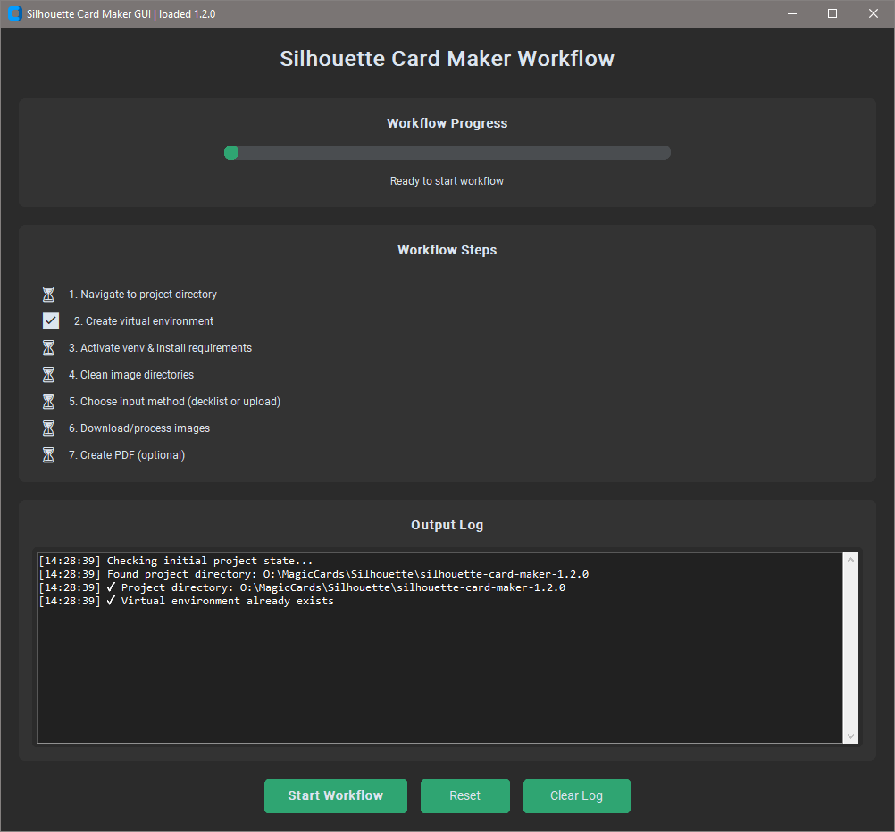
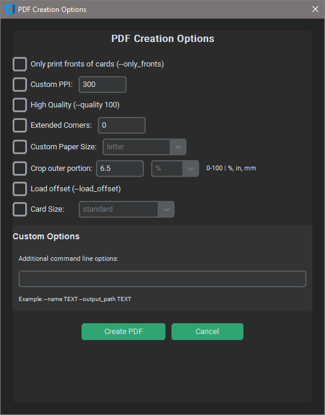

# Silhouette Card Maker GUI

**Version:** `1.0.0`
**Author:** *Unequal/Cxmplicated*

---

## 📌 Overview

The **Silhouette Card Maker GUI** is a graphical workflow manager for the `silhouette-card-maker` project.
It provides an easy-to-use interface for downloading, processing, and exporting card images into printable PDFs.

Instead of manually running scripts, this GUI guides you from setup to generating final print-ready sheets.

---

## ✨ Features

* **Simple step-by-step workflow** with visual progress indicators.
* **Multiple input methods:**

  * Upload your own card images.
  * Download cards automatically from supported plugins (e.g., Moxfield, MTGA, Archidekt, etc.).
* **Automatic image cleanup** before each run.
* **Thumbnail previews** before creating your PDF.
* **Custom PDF options** for print quality, paper size, card size, and more.
* **Version-aware title bar** — automatically shows the `silhouette-card-maker` version you’ve loaded.

---

## 📂 Supported Games & Import Methods

| Game                 | Import Methods                                       |
| -------------------- | ---------------------------------------------------- |
| Magic: The Gathering | Moxfield, MTGA, MTGO, Archidekt, Deckstats, Scryfall |
| Riftbound            | Pixelborn, TTS, Piltover                             |
| Yu-Gi-Oh!            | YDK, YDKE                                            |
| Lorcana              | Dreamborn                                            |
| Altered              | Ajordat                                              |

---

## 🛠 Setup Instructions

### 1️⃣ Prerequisites

* **Python 3.8+**
* **Pip** (comes with Python)
* A copy of the [silhouette-card-maker](https://github.com/Alan-Cha/silhouette-card-maker) project (version matching the file name).

---

### 2️⃣ Install & Extract Project Files

1. Run `pip install customtkinter` to install required dependancies.
2. Download the `silhouette-card-maker-x.x.x.zip` file from its official source.
3. Extract it to a known location (e.g., `Documents`, `Desktop`).
  or
2a. Place the GUI inside the extracted `silhouette-card-maker-x.x.x.zip` file
4. Ensure the extracted folder name matches the `PROJECT_FOLDER_NAME` in the GUI script:

   ```python
   PROJECT_FOLDER_NAME = "silhouette-card-maker-1.1.0"
   ```

---

### 3️⃣ Run the GUI

```bash
python GUI.py
```

The first run will:

* Locate the `silhouette-card-maker` folder.
* Create a virtual environment inside it.
* Install dependencies from `requirements.txt`.

---

## 📸 Example Screenshots

### Main Window



### Input Method Selection


### Image Preview


### PDF Options



---

## ⚙ PDF Options

When creating a PDF, you can customize:

* Only fronts
* Custom PPI
* High quality output
* Extended corners
* Custom paper size
* Crop settings
* Load offset
* Card size type
* Extra command-line options passed directly to `create_pdf.py`

---

## ❗ Troubleshooting

* **"Project directory not found":**
  Ensure `PROJECT_FOLDER_NAME` in `GUI.py` matches your extracted folder name exactly.
* **Dependencies won’t install:**
  Make sure Python is installed and `pip` is available in your PATH.
* **No images found in preview:**
  Only supported formats will display (`.png`, `.jpg`, `.jpeg`, `.webp`, etc.).
* **PDF not found after creation:**
  The generated PDF is usually in `game/output` or the main project folder.

---
